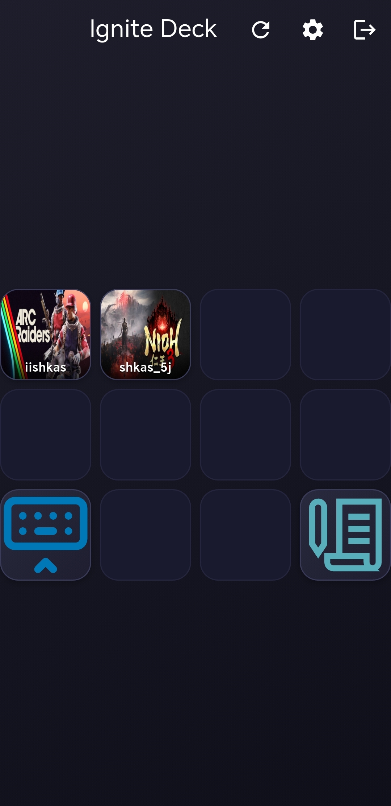
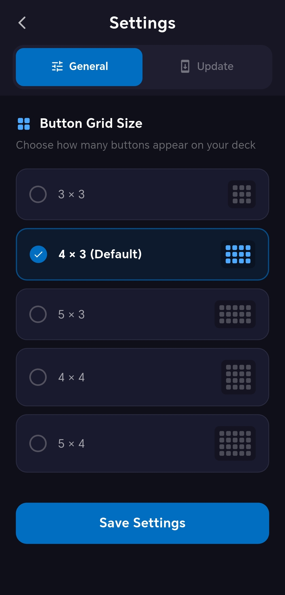

# IgnitePanel Companion App

The **IgnitePanel Companion App** allows you to control your IgnitePanel setup directly from your mobile device.  
It mirrors your main panel buttons and lets you trigger actions remotely through a clean and customizable grid interface.

---

## Screenshots

---

## Features

### Customizable Grid Layout
Choose from predefined grid layouts that fit your workflow:

- **3 × 3**
- **4 × 3**
- **5 × 3**
- **4 × 4**
- **5 × 4**

Each grid displays buttons from your main IgnitePanel setup, allowing you to trigger actions directly from your phone.

### Gesture Navigation
Navigate quickly between pages and profiles using gestures:

- **Swipe left / right** in empty space to switch between pages  
- **Swipe up / down** to change profiles

### Portrait & Landscape Support
The app fully supports both **portrait** and **landscape** orientations for a flexible control experience.

### Remote Action Execution
Execute buttons and actions from your IgnitePanel directly through the mobile app.

### Built-in Update System
The app includes an **integrated update system**, ensuring you always have access to the latest version.

---

## Download

[Download the latest version now](https://github.com/iiSHKAS/IgnitePanel-companion-app/releases/latest)
